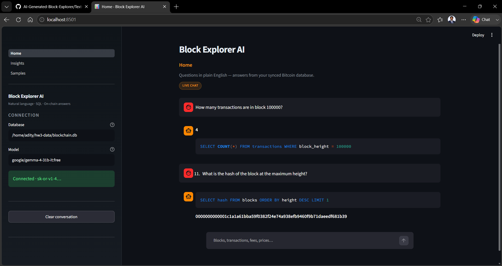
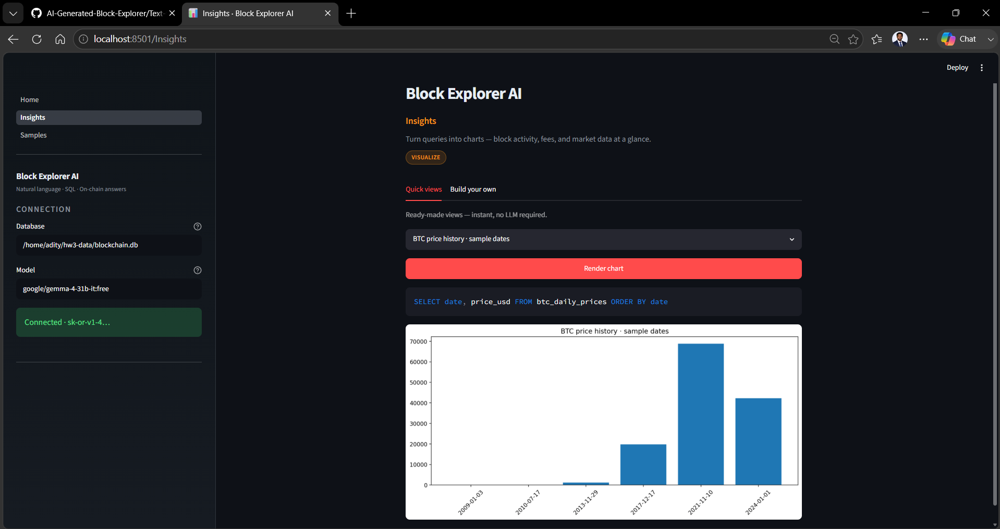
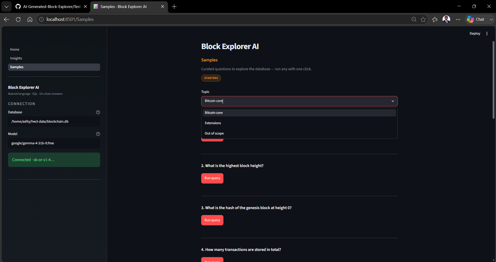

# AI-Generated Block Explorer

An AI-powered Bitcoin Block Explorer developed as part of INFO7500: Cryptocurrency and Smart Contracts at Northeastern University.

## Project Goal

The objective of this project is to build a blockchain explorer that combines Bitcoin blockchain data with Large Language Models (LLMs) to enable natural language interaction with blockchain information.

Users will be able to ask questions such as:

> How many blocks were mined today?

> What is the latest block height?

> Which block contains the most transactions?

The system will translate natural language questions into SQL queries and retrieve blockchain data automatically.

---

## Technology Stack

- Bitcoin Core
- Bitcoin RPC
- Docker
- Python
- SQLite
- OpenRouter
- Large Language Models (LLMs)

---

## Project Roadmap

### Week 2
Tooling for AI-Generated Block Explorer

- Docker setup
- Bitcoin Core build from source
- Bitcoin RPC validation
- LLM Text-to-SQL prototype

### Week 3
Text-to-SQL (`Text-to-SQL/`)

- SQLite schema from `getblock(hash, 2)` JSON
- Deterministic ingestion + scheduled updater
- Natural language → SQL → answers (OpenRouter)
- Test suite, hard-failure analysis, chat UI, charts

#### Block Explorer AI (Streamlit UI)

```bash
cd Text-to-SQL
./scripts/run_web_ui.sh ~/hw3-data/blockchain.db
# Open http://localhost:8501
```

| Page | Thumbnail | Description |
|------|-----------|-------------|
| **Home** | [](Text-to-SQL/screenshots/ui_demo_home.png) | Natural-language chat — question, generated SQL, and answer. |
| **Insights** | [](Text-to-SQL/screenshots/ui_demo_charts.png) | Charts from SQL query results (presets or custom questions). |
| **Samples** | [](Text-to-SQL/screenshots/ui_demo_examples.png) | Curated starter questions to explore the database. |

---

## Course

INFO7500 – Cryptocurrency and Smart Contracts

Northeastern University
