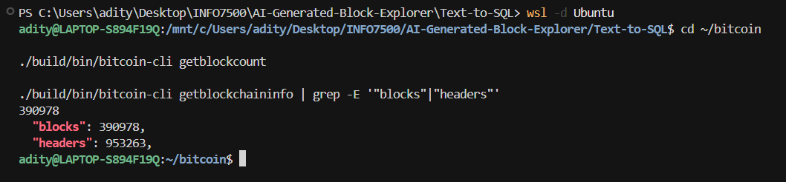
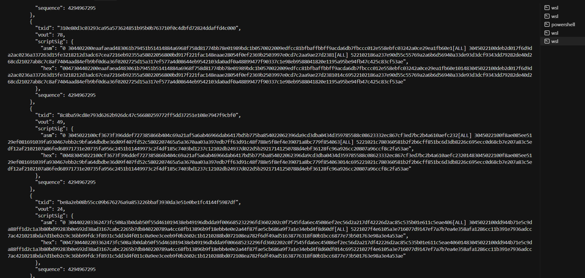
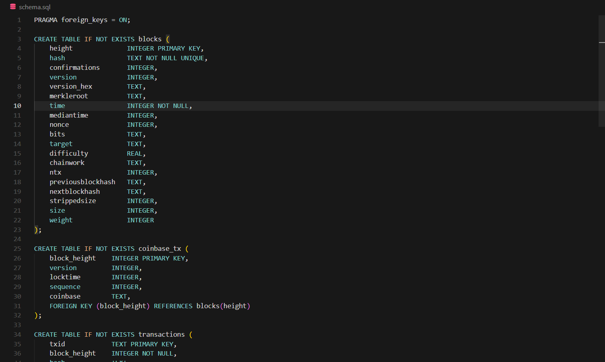
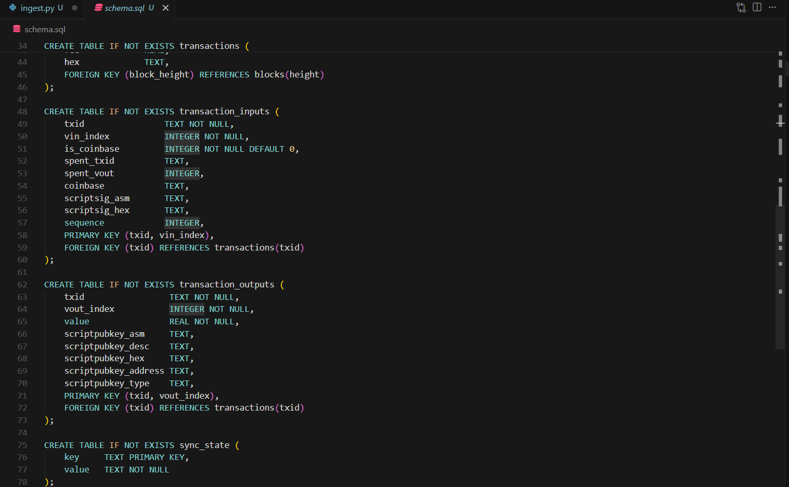
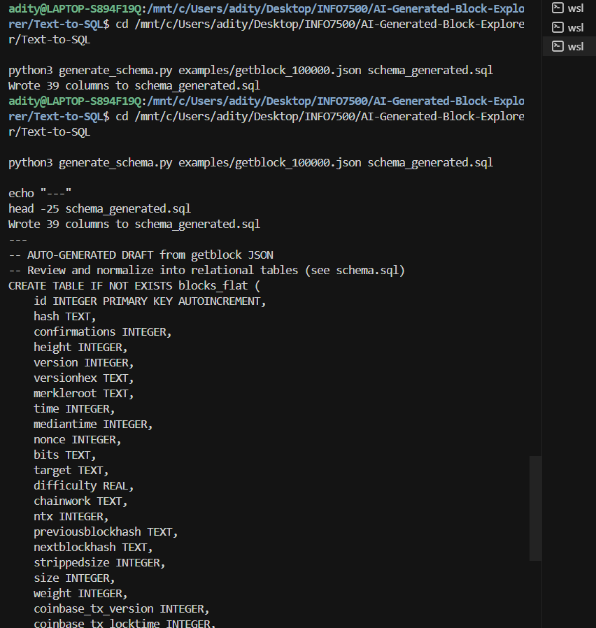
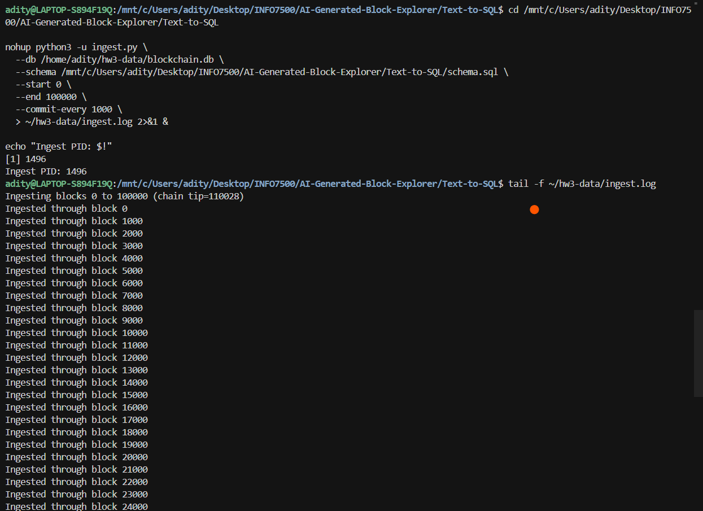
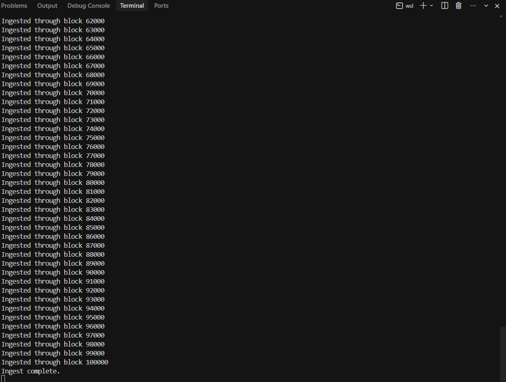
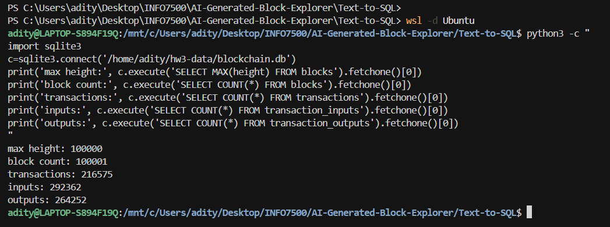
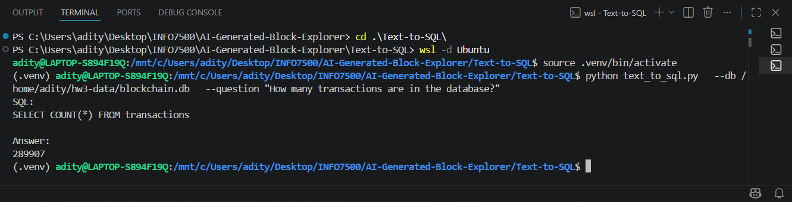
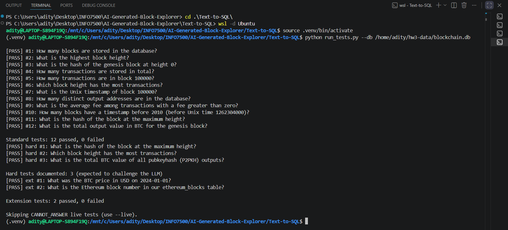

# Homework 3: Text-to-SQL — Block Explorer AI

## INFO7500 – Cryptocurrency and Smart Contracts

**Student:** Raghavendra Prasath Sridhar

---

# Assignment Overview

This assignment builds on **Homework 2** (`Tooling-for-AI-Generated-Block-Explorer/`) by connecting a live Bitcoin Core node to a SQLite database and enabling natural-language queries through a Large Language Model.

The objective was to:

1. Sync a local `bitcoind` node and ingest blockchain data via RPC
2. Design a normalized SQL schema from `getblock(blockhash, 2)` JSON
3. Keep the database updated with a cron-driven updater and validation checks
4. Evolve the HW2 Text-to-SQL prototype into a production pipeline (schema from the live DB, SQL execution, CLI, and web UI)
5. Document test cases, hard failure modes, and optional extensions (Ethereum, pricing, charts)

The Streamlit application is branded **Block Explorer AI** — plain-English questions over your synced on-chain database.

> Bitcoin Core uses **`getblock(blockhash, 2)`** (verbosity=2) for full block + transaction JSON. The assignment text sometimes says “getblocks”; this project uses `getblock`.

---

# Environment

| Component             | Details                              |
| --------------------- | ------------------------------------ |
| Host Operating System | Windows 11                           |
| Linux Environment     | Ubuntu WSL2                          |
| Programming Language  | Python 3                             |
| Blockchain Software   | Bitcoin Core (built in HW2)          |
| Database              | SQLite (`blockchain.db`)             |
| AI Platform           | OpenRouter                           |
| SDK                   | OpenAI Python SDK                    |
| Web UI                | Streamlit (Block Explorer AI)        |
| Database Location     | `~/hw3-data/blockchain.db` (WSL)     |

---

# Part 1 – Bitcoin Core Sync

## Objective

Run a local Bitcoin Core node, sync at least ~100,000 blocks, and verify RPC access for ingestion.

## Files

```text
check_node.py
scripts/generate_submission_proof.sh
```

## Commands

Start the node (from HW2 Bitcoin Core build):

```bash
cd ~/bitcoin
./build/bin/bitcoind -daemon
```

Verify RPC:

```bash
cd Text-to-SQL
python3 check_node.py
```

Proof log (optional):

```bash
./scripts/generate_submission_proof.sh ~/hw3-data/blockchain.db
```

## Result

The node synced **110,028+ blocks** (exceeding the ~100,000 requirement). RPC calls `getblockcount`, `getblockchaininfo`, and `getblock` on the chain tip returned valid responses.

### Screenshot – Bitcoin Core

| Thumbnail | Description |
|---|---|
| [](screenshots/bitcoin_node_startup.png) | `bitcoind -daemon` started successfully; node begins network synchronization. |
| [](screenshots/getblock_rpc_output.png) | `getblock` RPC output on the chain tip (`check_node.py` / `bitcoin-cli`). |

---

# Part 2 – SQL Schema Design

## Objective

Design a normalized SQLite schema that captures all data elements from `getblock(blockhash, 2)` JSON, including blocks, transactions, inputs, outputs, and coinbase metadata.

## Files

```text
schema.sql
schema_generated.sql
generate_schema.py
examples/getblock_100000.json
prompts/
```

## Final Schema

The production schema (`schema.sql`) uses five normalized tables:

```text
blocks
coinbase_tx
transactions
transaction_inputs
transaction_outputs
```

Additional supporting objects: `sync_state`, `txinwitness`.

## Bonus – Auto-Generate Schema from JSON

Two approaches were implemented per the assignment bonus:

### Approach 1 – LLM generates SQL directly

```bash
python3 prompts/run_approach1.py
```

Output: `prompts/schema_llm_direct.sql`

### Approach 2 – Code generates SQL from JSON

```bash
python3 generate_schema.py examples/getblock_100000.json schema_generated.sql
```

Output: `schema_generated.sql` (flat draft) → manually refined into `schema.sql`

Documentation: `prompts/schema_llm_prompt.md`, `prompts/prompt_engineering_examples.md`

### Screenshot – Schema Design

| Thumbnail | Description |
|---|---|
| [](screenshots/schema_design_1.png) | Normalized schema overview — `blocks`, `transactions`, and core relationships. |
| [](screenshots/schema_design_2.png) | Input/output tables (`transaction_inputs`, `transaction_outputs`, `coinbase_tx`) and foreign keys. |
| [](screenshots/schema_generation_bonus.png) | `generate_schema.py` output and auto-generated `schema_generated.sql` (bonus). |

---

# Part 3 – Ingestion, Updater, and Validation

## Objective

Ingest blocks from `bitcoind` RPC into SQLite, keep the database current via a scheduled updater, and validate consistency after each run.

## Files

```text
ingest.py
updater.py
validate.py
ingest_extensions.py
schema_extensions.sql
scripts/install_cron.sh
crontab.example
```

## Initial Ingest

```bash
python3 ingest.py --db ~/hw3-data/blockchain.db --start 0 --end 100000
python3 ingest_extensions.py --db ~/hw3-data/blockchain.db
python3 validate.py --db ~/hw3-data/blockchain.db
```

## Manual Update

```bash
python3 updater.py --db ~/hw3-data/blockchain.db
```

## Cron (every 5 minutes)

```bash
./scripts/install_cron.sh ~/hw3-data/blockchain.db
```

Logs: `logs/cron.log`, `logs/updater.log`

## Validation

`validate.py` checks height continuity, `ntx` counts, foreign keys, and optional RPC tip cross-check.

## Result

```text
Validation passed.
```

The updater ingested blocks beyond the initial 100k range (110k+ blocks in the database).

### Screenshot – Validation

| Thumbnail | Description |
|---|---|
| [](screenshots/blockchain_initial_ingestion.png) | Initial block ingestion via `ingest.py` (blocks 0–100,000). |
| [](screenshots/blockchain_ingestion_completed.png) | Ingestion run completed; database populated with block data. |
| [](screenshots/database_population.png) | Row counts and sample queries confirming the database is populated. |

---

# Part 4 – Text-to-SQL

## Objective

Convert natural language questions into SQL against the live SQLite database, execute the query, and return the answer. Evolve the HW2 prototype (`Tooling-for-AI-Generated-Block-Explorer/text_to_sql.py`) with live schema loading and result execution.

## Files

```text
text_to_sql.py
chat.py
project_env.py
Home.py
web_ui.py
pages/2_Insights.py
pages/3_Samples.py
ui_shared.py
charts.py
```

## System Prompt

The assignment-specified system prompt is stored in `text_to_sql.CORE_SYSTEM_PROMPT`:

```text
You are a SQL developer that is expert in Bitcoin and you answer natural
language questions about the bitcoind database in a sqlite database. You
always only respond with SQL statements that are correct.
```

The database schema is loaded from `sqlite_master` and included in the user message (instance).

## CLI Usage

```bash
python3 text_to_sql.py \
  --question "How many blocks are in the database?" \
  --db ~/hw3-data/blockchain.db
```

Interactive chat:

```bash
python3 chat.py --db ~/hw3-data/blockchain.db
```

## Block Explorer AI (Streamlit)

```bash
./scripts/run_web_ui.sh ~/hw3-data/blockchain.db
```

Open **http://localhost:8501** in your system browser.

| Page | Purpose |
|------|---------|
| **Home** | Natural-language chat |
| **Insights** | Charts from SQL query results |
| **Samples** | Curated starter questions |

### Example Query

**Question**

```text
How many blocks are stored in the database?
```

**Generated SQL**

```sql
SELECT COUNT(*) FROM blocks
```

**Answer**

```text
110029
```

### Screenshot – Text-to-SQL CLI

| Thumbnail | Description |
|---|---|
| [](screenshots/text_to_sql_demo.png) | Terminal output: natural language question → generated SQL → answer. |

### Screenshot – Block Explorer AI (Home)

| Thumbnail | Description |
|---|---|
| [](screenshots/ui_demo_home.png) | Block Explorer AI Home page with a chat question, SQL, and answer visible. |

### Screenshot – Block Explorer AI (Insights)

| Thumbnail | Description |
|---|---|
| [](screenshots/ui_demo_charts.png) | Insights page with a rendered chart from a preset or custom query. |

### Screenshot – Block Explorer AI (Samples)

| Thumbnail | Description |
|---|---|
| [](screenshots/ui_demo_examples.png) | Samples page with curated starter questions. |

---

# Part 5 – Test Cases

## Objective

Define at least 10 test triples (question, SQL, answer) and verify them against the database.

## Files

```text
tests/test_cases.json
tests/extension_cases.json
run_tests.py
scripts/refresh_test_answers.py
```

## Command

```bash
python3 run_tests.py --db ~/hw3-data/blockchain.db --standard-only
```

## Result

```text
Standard tests: 12 passed, 0 failed
```

Golden tests validate the **database and reference SQL** — no LLM required.

### Screenshot – Golden Tests

| Thumbnail | Description |
|---|---|
| [](screenshots/test_suite_results.png) | `run_tests.py --standard-only` showing 12/12 pass. |

---

# Part 6 – Hard Text-to-SQL Failures

## Objective

Document three cases where incorrect SQL still returns a plausible wrong answer, and present them for class discussion.

## Files

```text
tests/hard_failures.json
slides/hard_failures.html
scripts/refresh_hard_failures.py
capture_live_hard.py
```

## Presentation

Open in browser (arrow keys to navigate, F11 for fullscreen):

```text
slides/hard_failures.html
```

## Example Hard Case

**Question**

```text
Which block height has the most transactions?
```

**Correct SQL**

```sql
SELECT block_height FROM transactions
GROUP BY block_height
ORDER BY COUNT(*) DESC
LIMIT 1
```

**Incorrect SQL (common LLM mistake)**

```sql
SELECT MAX(block_height) FROM transactions
```

The wrong query returns the highest block *with any transaction*, not the block with the *largest transaction count*.

Live LLM results are documented honestly in `tests/LIVE_LLM_RESULTS.md`.

---

# Notes – Extensions

Optional features beyond the core assignment:

| Feature | Implementation |
|---------|----------------|
| Ethereum sample block | `schema_extensions.sql`, `examples/eth_block_sample.json`, `ingest_extensions.py` |
| BTC daily prices (historical) | `btc_daily_prices` table, `examples/btc_prices_sample.json` |
| CANNOT_ANSWER | `text_to_sql.py` + `tests/cannot_answer_cases.json` |
| Charts | `charts.py` + Insights page |
| Chat UI | `Home.py`, `chat.py`, Samples page |

Refresh answers after the updater syncs new blocks:

```bash
python3 scripts/refresh_test_answers.py ~/hw3-data/blockchain.db
python3 scripts/refresh_hard_failures.py ~/hw3-data/blockchain.db
```

---

# Setup

```bash
cd Text-to-SQL
python3 -m venv .venv
source .venv/bin/activate
pip install -r requirements.txt

cp .env.example .env
# Edit .env: OPENROUTER_API_KEY=sk-or-v1-...
```

Use `~/hw3-data/blockchain.db` on WSL — avoid storing the database on `/mnt/c/...` (SQLite disk I/O errors).

`blockchain.db` (~500 MB+) is **gitignored**. Do not commit `.env`, `logs/`, or `.venv/`.

---

# Deliverables

This folder contains:

```text
Text-to-SQL/
│
├── README.md
├── schema.sql
├── schema_extensions.sql
├── schema_generated.sql
├── generate_schema.py
├── ingest.py
├── ingest_extensions.py
├── updater.py
├── validate.py
├── check_node.py
├── text_to_sql.py
├── chat.py
├── charts.py
├── run_tests.py
├── Home.py
├── web_ui.py
├── ui_shared.py
├── pages/
│   ├── 2_Insights.py
│   └── 3_Samples.py
├── tests/
│   ├── test_cases.json
│   ├── hard_failures.json
│   ├── cannot_answer_cases.json
│   ├── extension_cases.json
│   └── LIVE_LLM_RESULTS.md
├── slides/
│   └── hard_failures.html
├── prompts/
├── scripts/
├── examples/
├── screenshots/
├── SUBMISSION.md
└── SUBMISSION_CHECKLIST.md
```

**Prerequisite (submitted separately):** `Tooling-for-AI-Generated-Block-Explorer/` — Docker, Bitcoin Core build, HW2 Text-to-SQL prototype.

---

# Learning Outcomes

This assignment provided practical experience with:

* Bitcoin RPC data extraction (`getblock` verbosity=2)
* Relational schema design from nested JSON
* LLM-assisted schema generation and prompt engineering
* Deterministic ETL pipelines (ingest, updater, cron)
* Database validation and consistency checks
* Natural language to SQL with live schema context
* Test-driven verification of blockchain query pipelines
* Documenting LLM failure modes (wrong column, wrong aggregation, domain enums)
* Streamlit web applications for interactive blockchain exploration
* Optional multi-chain and pricing extensions

---

# Conclusion

Homework 3 successfully connects the HW2 Bitcoin tooling to a populated SQLite database and an AI-powered query interface. The pipeline ingests real chain data, validates it on every update, passes 12/12 golden SQL tests, and exposes both CLI and web interfaces for natural-language exploration. Hard failure cases and live LLM results are documented to show where free-tier models still struggle despite schema context.

The **Block Explorer AI** application is ready for demonstration, screenshot capture, and class presentation via `slides/hard_failures.html`.
